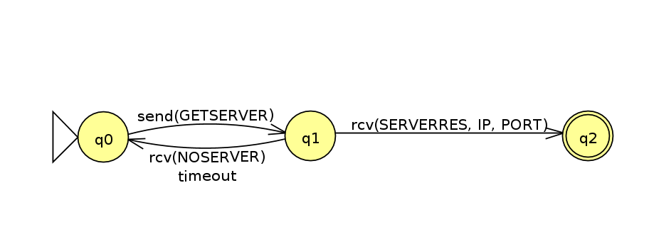

---
title: "Mensajes y autómatas"
author: [Carlos Cañellas Tovar, Sergio Raúl Rech Lizon]
date: "20 de abril de 2020"
subject: "Redes de Comunicaciones"
keywords: [Markdown, Example]
subtitle: "Formato de los mensajes y su funcionamiento y autómatas de cada aplicación"
lang: "es"
titlepage: true,
titlepage-text-color: "FFFFFF"
titlepage-rule-color: "360049"
titlepage-rule-height: 0
titlepage-background: "background.pdf"
page-background: "backgroundPage.pdf"
page-background-opacity: 0.1
output: pdf_document
...

# Formato de mensajes

## Mensajes binarios al directorio

Se usan OPCODEs que corresponden a un número entero.

- `OK`: Confirmación del registro de un servidor.

    Código: 1
    
    Formato: un byte que contiene el número de código.

- `NOSERVER`: Se envía en la respuesta vacía, en ausencia de servidor.

    Código: 2
    
    Formato: un byte que contiene el número de código.

- `REGISTER`: Lo usarán los servidores de chat. Sirve para registrar tal servidor en el directorio.

    Código: 3
    
    Formato: un byte que contiene el número de código + el tamaño de un entero para el protocolo + el tamaño de un entero para el puerto.
    
    En total 9 bytes.
    
    Se asume que el tamaño de un número entero en Java estándar son 4 bytes (32 bits).

- `GETSERVER`: Lo usarán los clientes para obtener el servidor que corresponde con su protocolo.

    Código: 4
    
    Formato: un byte que contiene el número de código + el tamaño de un entero para almacenar el protocolo.
    
    En total 5 bytes.

- `SERVERRES`: Respuesta a un `GETSERVER`. Contiene los datos del servidor.

    Código: 5
    
    Formato: un byte que contiene el número de código + un array de 4 bytes con la IP del servidor + el tamaño de un entero para el puerto.

    En total 9 bytes.

## Mensajes Campo-valor

- NCNickMessage

```
operation:1\n
nick:<nick>\n // Siendo <nick> el nick elegido.
\n
```

- NCRoomMessage

```
operation:2\n
\n
```

- NCEnterMessage
```
operation:3\n
room:<room>\n // Siendo <room> la habitación.
\n
```
Se responde con la siguiente operación si se entra con éxito:

- NCInRoomMessage
```
operation:4\n
\n
```
- NCSendMessage
```
operation:5\n
message:<message>\n // Los saltos de línea in-message son %n
\n
```

- NCExitMessage
```
operation:6\n
\n
```

- NCInfoMessage
```
	operation:7\n
	\n
```
Se responde con lo siguiente:

- NCInfoReplyMessage
```
	operation:8\n
	topic:<topic>\n
	users:<lista de usuarios>\n
	\n
```

# Autómatas

La interacción cliente-servidor se ha dividido en dos autómatas para mayor claridad.

## Autómata del cliente con el directorio



## Autómata del servidor con el directorio


## Autómata del servidor para recibir peticiones del cliente y procesarlas


## Autómata del cliente para enviar peticiones al servidor y recibir respuestas


